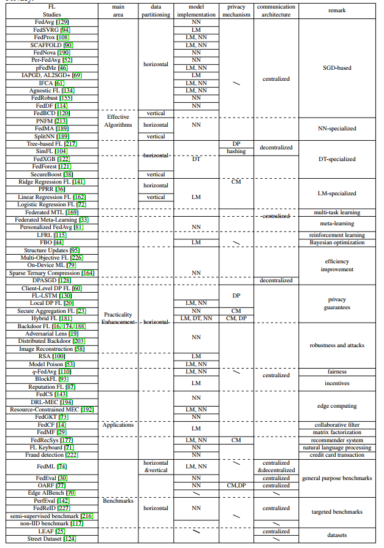

# はじめに

本ドキュメントは、連合学習と連合学習に関する技術やライブラリについてまとめたもので、
連合学習の環境構築者向けのドキュメントとなる。

連合学習の環境構築者は、主にネットワーク・グラフや並列処理・分散処理（スーパーコンピュータ）に関する知識が重要となる。

## 連合学習とは

データを取集せずに学習モデルを合成し、学習モデルを改善していく手法。
データを収集し学習する従来の手法だとプライバシーの問題があるため、近年、異なるドメイン間でデータを送信せず学習させる手法として注目を集める。

転移学習との違いは？？

## 参考論文

- [A Survey on Federated Learning Systems: Vision, Hype and Reality for Data Privacy and Protection](./pdf/1907.09693.pdf)

## メリット・デメリット

- M: プライバシーの問題を回避できる
- D: 従来のデータセンターでの学習は、学習データの偏りをコントロールできますが、連合学習の場合、データが散らばっているため偏りをコントロールすることができない

より詳しくは次のリンクを参照

- [進歩と未解決の問題](https://arxiv.org/pdf/1912.04977.pdf)

## 連合学習フロー

モデルは次のフローで改善されていく

1. train: Edge側で学習済みモデルを生成する
2. feedback: 複数のEdgeからサーバへモデルを送信する
3. aggregate: モデルを合成する
4. transfer:  合成されたモデルをEdgeへ展開する

## 機械学習の一般的なフロー

1. データ収集
2. データ加工・クレンジング
3. データロード
4. モデル学習
5. モデル評価
6. モデルデプロイ（本番稼働）
7. モデル監視（運用）

## 並列・分散・連合処理について

並列・分散・連合処理について、次のように区別することとする。

1. 並列: １つのマシン上で複数のCPUで同一データセットで同一処理を行い結果を集約する
2. 分散: 複数のマシン上で同一データセットで同一処理を行い（並列を組み合わせてもよい）結果を集約する
3. 連合: 複数のマシン上あるいは複数のCPUを用いて、データセットを共有せず同一処理を行い結果を集約する

連合学習のユースケースとしては、

1. 企業Ａ内のデータセットAを企業Ａ内のEdge A, Edge Bを用いて並列処理でモデルAを生成
2. 企業Ｂ内のデータセットBを企業B内のEdge C, Edge Dを用いて並列処理でモデルBを生成
3. 連合学習サーバにモデルA, モデルBを集約しモデルCを生成
4. 異なる連合学習サーバで生成したモデル群を集約し、モデルDを生成（クロスサイロ）

ということができる理解。

ただし、4.のケース（複数の連合学習サーバ）を組み合わせることは未対応の模様。

https://github.com/FedML-AI/FedML/issues/59

疑問

モデルは隣接ノードの資源を使って集約されていく？
連合学習サーバで集約される？

## 転移学習（Transfer learning）

別のタスクで学習された知識を転移する機械学習の手法

## 体系

- Federated Learning Systems
    - Machine Learning Model
        - Horizontal
        - Vertical
        - Hybrid
    - Data Partitioning
        - Linear Models
        - Decision Trees
        - Neural Networks
    - Privacy Mechanism
        - Differential Privacy
        - Cryptographic Methods
    - Communication Architecture
        - Centralized
        - Decentralized
    - Scale of Federation
        - Cross-silo
        - Cross-device
    - Motivation of Federation
        - Incentive
        - Regulation

## コミュニケーション

集中型設計と分散型設計の2つの主要な⽅法がある。

### 集中型（centralized）

マネージャーはパーティからの情報（ローカルモデルなど）を集約し、トレーニング結果を送り返す。
グローバルモデルのパラメーターの更新は、常にこのマネージャーで行われる。

### 分散型（decentralized）

通信はパーティ間で実行され、すべてのパーティはグローバルパラメータを直接更新できます。
分散型通信アーキテクチャの設計は困難であり、公平性と通信オーバーヘッドを考慮に⼊れる必要がある。

公平性を担保するために次のような分散技術を使う。

- P2P
- グラフ
- ブロックチェーン

## スケーリングについて

### cross-device

データの所有者自体の数が多いが、データや計算資源は少ない。
IOT機器など。

### cross-silo（クロスサイロ）

データの所有者自体の数は多くないが、データや計算資源は比較的十分にある。
企業間での連合学習などのケース。

## 分散アルゴリズム

分散アルゴリズムを実装する時、次の要素が重要となる。

- システムの不均一性
- データの不均一性
- スケーラビリティ

## トポロジ

分散型機械学習では、コンピュータネットワークの接続形態（トポロジ）を考慮する必要がある（どのような時、何を選ぶかについては理解していない）。

FedMLには、垂直FL、分割学習、分散型FL、階層型FLなどのさまざまなトポロジ定義がある。

- バス
- スター
- リング
- フルメッシュ
- パーシャルメッシュ
- Centralized
- Hierarchical
- Decentralized
- Vertical
- Split

### symmetry（左右対称）

分散型（SimFLなど）では通信が直接データの所有者同士で行われ、すべてのデータの所有者がグローバルなパラメータを更新することができる

### asymmetry（左右非対称・非対称トポロジ）

集中型（FedAvgなど）は、データの流れは非対称で、マネージャーがローカルモデルの情報を集計し、グローバルなパラメータをアップデートする。

## データパーティションについて

### 集中型（FedAVG）

データの流れは非対称で、マネージャーがローカルモデルの情報を集計し、グローバルなパラメータをアップデートする。
セキュリティリスクが高いらしい。

### 分散型（SimFL）

通信が直接データの所有者同士で行われ、すべてのデータの所有者がグローバルなパラメータを更新するあ。

データの流れは非対称とは？？？

## インセンティブ設計

クロスデバイス設計では、マネージャーは強力な中央サーバ。
クロスサイロ設定では、組織は強力なマシンを持っていることが期待されるため、マネージャーはFLプロセスを支
配する組織の1つになることもできます。

## 通信

### simulated

### distributed

## セキュリティ

### Differential privacy（DP・差分プライバシー）

個々のレコードが学習に参加しているかどうかを当事者が知ることができないようにする手法。

### Cryptographic methods（CM・暗号化手法）

当事者は、送信する前にメッセージを暗号化し、暗号化されたメッセージを操作し、暗号化された出力を復号化して最終結果を取得する手法。

## モデル

### NN

### DT

### LM

## アルゴリズム

## 更新タイミング・プッシュ型・プル型

グローバルパラメータをいつ更新するのか？
ローカルへの展開はどのタイミングで行われるか。

プル型

1. 学習開始時に、最新のモデルをダウンロードし、学習終了後に、ローカルで更新されたモデルをプッシュする
2. または、1.の後に最新のモデルがダウンロードされるまで待機する

プッシュ型

1. グローバルパラメータが更新されたら、自動的にローカルに展開（NFSがあると、1度の展開で済み効率的）

## メモ

連合転移学習とは