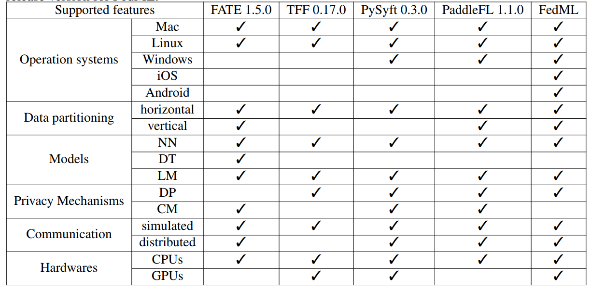

# research

## OSS

- [FedML](https://github.com/FedML-AI/FedML): star 1.1k
- [FATE](https://github.com/FederatedAI/FATE): star 4.1k
- [TensorFlow Federated](https://github.com/tensorflow/federated): star 1.8k
- [PySyft](https://github.com/OpenMined/PySyft): star 8k トロポジ
- [PaddleFL](https://github.com/PaddlePaddle/PaddleFL): star 0.3k
- [fedn](https://github.com/scaleoutsystems/fedn): star 59
- [byteps](https://github.com/bytedance/byteps): star 3k

## 比較

Communicationのsimulatedは、疑似的な分散シミュレーション（つまり、スタンドアロンで実行）が可能なことだと思われる。



|  フレームワーク |  クロスデバイス  | クロスサイロ | 通信 | ライセンス | CPU利用 |
| ---- | ---- | ---- | ---- | ---- | ---- |
| FedML | true | false? | MPI/HTTP2(GRPC) + SSH |  | true |
| FATE | true | ? |  |  |  |
| TensorFlow Federated | true | ? |  |  |  |
| PySyft | true | ? | HTTP(Websocket) |  |  |
| PaddleFL | true | ? |  |  |  |
| fedn | true | ? |  |  |  |
| byteps | true | ? | HTTP |  | false |


## FedML

連合学習における有名なライブラリ

- [公式ドキュメント](https://doc.fedml.ai/overview.html)
- [リポジトリ](https://github.com/FedML-AI/FedML)
- [連合学習に関する論文など](https://github.com/chaoyanghe/Awesome-Federated-Learning)


複数のノードへのモデル展開など複雑なワークフローを簡略化し、連合学習の実行を支援する

## 機能

次のリンクからGUIから提供している機能を調べた

- [ライブデモ](http://open.fedml.ai)
- [ライブデモ説明](https://doc.fedml.ai/user_guide/mlops/mlops_live_demo.html)

### 管理機能

- ユーザ管理
- グループ管理
- プロジェクト管理
    - グループは１つのみアタッチすることができる
- 計算ノード（エッジ）管理
- 構成管理（モデルとハイパーパラメータなど学習に関する設定）
- 学習を開始する
    - 構成を指定する
    - デバイスを指定する
- ジョブ管理
    - 開始したジョブに名前とタグをつけることができる
    - ステータスを確認することができる
    - トレーニング結果の視覚化
    - Edgeのシステムパフォーマンスの視覚化
    - 分散ロギング
    - client modelとaggregated modelを確認することができる
    - client modelとaggregated modelはrunidに紐づいている
    - FLServer - ユーザー - Edge Deviceの繋がりが見える

### 実装されていない機能

- 任意のタイミングで自動実行するジョブスケジューラは特に見当たらない
- 1つ連合学習のサイクルを管理。関連するジョブフローなどの実行などは管理していない。


## アーキテクチャ

- fedml_core: 動的計画法に基づく分散コンピューティングに関する通信やスケジューラを提供
- fedml_api: 連合学習アルゴリズムを提供
- fedml_experiments: fedmlのアルゴリズムのテスト機能を提供
- fedml_mobile: スマートフォンを使用したデバイス上のトレーニングをサポート
- fedml_IoT: IoTデバイスを使用したデバイス上のトレーニングをサポート


## ソースコードの読み方

https://doc.fedml.ai/user_guide/open_source/algorithm-reference-implementation.html

### fedml_experiments

fedmlのアルゴリズムのテストを提供し、どのようにアルゴリズムを実装するかサンプルを確認できる。

- https://github.com/FedML-AI/FedML/tree/master/fedml_experiments


|  タイプ/リンク |  概要  | 論文 |
| ---- | ---- | ---- |
|  [centralized/fedgkt](https://github.com/FedML-AI/FedML/tree/master/fedml_experiments/centralized)  |  単体プロセスでの学習  |  |
|  [standalone/decentralized](https://github.com/FedML-AI/FedML/tree/master/fedml_experiments/standalone/decentralized)  |  片側信頼ソーシャルネットワークを介した中央サーバーの自由連合学習（分散型FL）  | [リンク](./pdf/1910.04956.pdf) |
|  [distributed/fedgkt](https://github.com/FedML-AI/FedML/tree/master/fedml_experiments/distributed/fedgkt)  |  大規模エッジ群でのCNN連合学習  |  |
|  fedavg  | エッジデバイスが中央サーバのプライバシー保護を信頼していない場合に選択される学習パラダイム | [リンク](./pdf/2104.11375.pdf) |


### fedml_api

連合学習アルゴリズムの実装を提供

- https://github.com/FedML-AI/FedML/tree/master/fedml_api


### fedml_core

動的計画法に基づく分散コンピューティングに関する通信やスケジューラを提供

- https://github.com/FedML-AI/FedML/tree/master/fedml_api


FedML-coreは、通信とモデルトレーニングを2つのコアコンポーネントに分離。

1. 通信プロトコルコンポーネント
2. PyTorchまたはTensorFlowに基づいて構築されたデバイス上のディープラーニングコンポーネント

## Worker-Oriented Programming

FedML-coreは、FLアルゴリズムのトレーニングまたは調整に参加するときに、ワーカーの動作をプログラムするために使用できる、
ワーカー指向のプログラミングデザインパターンを提供する

- Coordinator: 中央ワーカーでトレーナの管理をする
- Trainer: 中央ワーカー以外のワーカー


## 通信について

FedMLは、次の通信規格を使用可能。

- MPI
- MQTT
- GRPC
- TRPC

|  規格名 |  レイヤー  | スループット |
| ---- | ---- | ---- |
| MPI | TCP/IP | High |
| MQTT | TCP/IP | High |
| GRPC | HTTP2 | low |
| TRPC | HTTP? | low |


通信バックエンドを検討する時、レイヤーとスループットの観点で検討する。


学習にPyTorchを用い、デフォルトでMPIを通信バックエンドに利用する。

なお、BytePSというフレームワークは、MPIではなくクラウドベースの模様。


WSGIの実装であるwerkzeug
mod_wsgiへのインターフェースとしてWerkzeug


ASGIは、HTTP Trailersを処理しない。
gRPCストリームではHTTP Trailersを使用するため、ASGIは対応できない。

https://developer.mozilla.org/en-US/docs/Web/HTTP/Headers/Trailer

### MPI

Point-to-Pointとグループ通信がサポートされる。
MPIはOSI参照モデルの役割にあてはめると、役割としては5層（セッション層）以上に対応すると考えられるが、実際の実装ではソケットとTCP（トランスポート層）を使用している。

MPI_Comm_rank: 自分のプロセス番号（＝ランク）を取得
MPI_Comm_size: 実行に参加しているプロセス数を取得

- [pythonバインディング](https://mpi4py.readthedocs.io/en/stable/index.html)

インストールにはMPIを実装した共有ライブラリが必要。

```
sudo apt-get install libopenmpi-dev
python3 -m pip install mpi4py
```

```
# mpi4py.MPI.Open_portでMPIプロセスのグループ間の接続を確立するために使用できるアドレスを返す

from mpi4py import MPI
MPI.Open_port()

# port_name文字列 でエンコードされたネットワークアドレス
# => '4206821377.0:3078334918'
```

### MQTT

主にIOTなど、低電力でコンパクトである場面でのメッセージングで主流となってきている。

### GRPC

HTTP2上に構築されるRPCプロトコル。

GPRCのサンプルは次で紹介されている。

- https://github.com/FedML-AI/FedML/tree/master/fedml_experiments/distributed/fedavg
- https://github.com/FedML-AI/FedML/tree/master/scripts/aws

```
#!/bin/bash
DEV_NODE=fedml-grpc-server
LOCAL_PATH=/Users/hchaoyan/source/FedML/
REMOTE_PATH=/home/ec2-user/FedML_gRPC
alias ws-sync='rsync -avP -e ssh --exclude '.idea' $LOCAL_PATH $DEV_NODE:$REMOTE_PATH'
ws-sync; fswatch -o $LOCAL_PATH | while read f; do ws-sync; done

# fswatch -o 現在のバッチの変更イベントの数を含む単一のメッセージを出力します。
```

GRPCのサンプル定義ファイルは次に存在する。

- https://github.com/FedML-AI/FedML/tree/e0c58c539bf1d7ae9911e57d7f223ac19af03902/fedml_core/distributed/communication/gRPC/proto


FastAPIとGRPCの両方（１度の定義で両対応）をサポートするフレームワーク。スター数が少ないのがネック。

https://bali-framework.github.io/bali/


### TRPC

HTTP2


## ファイル同期方式

- MPIはssh経由で同期を行う。https://docs.open-mpi.org/en/v5.0.x/running-apps/quickstart.html#launching-in-a-non-scheduled-environments-via-ssh
- GRPCにおいては、GRPCで利用するHTTP通信に加え、rsyncの支援スクリプトを使っている。

上記のことから、NFS上にユーザ毎のフォルダを作る前提の作りになっているようだ。

